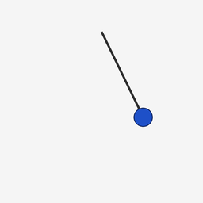

# DMD Pendulum Dynamics



This project applies **Dynamic Mode Decomposition (DMD)** to a synthetic pendulum video sequence. The goal is to show how DMD can learn low-rank temporal structure from high-dimensional image data and use that structure for mode analysis, reconstruction, forecasting, and background/foreground separation.

The synthetic pendulum is a controlled visual dynamical system: each video frame is a high-dimensional pixel observation, but the underlying motion is mostly governed by a low-dimensional periodic swing. This makes it a cleaner and more interpretable DMD example than noisy real-world forecasting tasks.

## Prerequisite Topics

See here for a crash course on Modes, Eigenvalues, Matrix Exponentials and DMD: [Background Part 1](docs/crash_course_001.md) and [Background Part 2](docs/crash_course_002.md)

## Notebook

[Open the notebook](DMD_pendulum_video.ipynb)

The notebook walks through:

- DMD snapshot matrices and rank truncation
- singular-value decay and low-rank structure
- eigenvalues, modes, growth rates, and frequencies
- reconstruction of observed pendulum frames
- forecasting of held-out future frames
- background/foreground separation from DMD modes
- bob-centroid trajectory forecasting
- rank sensitivity and interpretation of results

## Project Structure

```text
DMD/
├── DMD_pendulum_video.ipynb
├── README.md
├── helpers/
│   └── make_synthetic_pendulum.py
├── docs/
│   └── images/
│       └── synthetic_pendulum_preview.gif
└── outputs/
    └── synthetic_pendulum/
```

`outputs/` contains generated frames, masks, metadata, ground-truth coordinates, and preview artifacts. It is treated as generated output rather than source material.

## Generate the Synthetic Pendulum Data

From the `DMD/` folder:

```bash
python helpers/make_synthetic_pendulum.py --overwrite --background-mode grid --noise-std 2
```

This generates:

* RGB video frames
* foreground masks for the arm and bob
* bob-only masks
* ground-truth pendulum angle and bob coordinates
* metadata describing the generated sequence
* a README-friendly preview GIF under `docs/images/`

## Why This Example Works Well for DMD

DMD is designed to approximate the time evolution of a system from sequential observations. In this project, each image frame is flattened into a state vector, and DMD learns an approximate linear time-advance model:


$$x_{k+1} ≈ A x_k$$


For the pendulum sequence, the learned DMD modes capture interpretable structure:

* persistent modes correspond to static background content
* oscillatory modes correspond to pendulum motion
* eigenvalue phases encode frequency information
* eigenvalue magnitudes describe growth or decay behavior

Because the true pendulum trajectory is known, the notebook can compare DMD reconstructions and forecasts against ground truth both visually and numerically.

## Summary

This project is a compact theory-to-implementation demonstration of Dynamic Mode Decomposition on video data. It emphasizes mathematical interpretation, visual diagnostics, and the connection between low-rank linear models and high-dimensional dynamical observations.